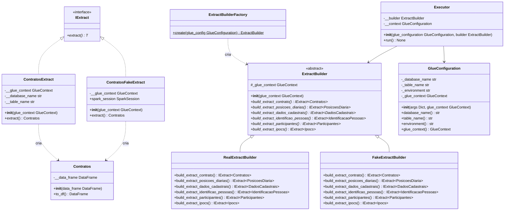

# projeto-cadip

## Pré-requisitos
- python 12


## Configuração
```bash
pip install -r app/requirements.txt
```

Executa o projeto:
```bash
python app/main.py 
```

## Exemplo de filter
```python
import sys
from awsglue.transforms import *
from awsglue.utils import getResolvedOptions
from pyspark.context import SparkContext
from awsglue.context import GlueContext
from awsglue.job import Job

# Inicialização do Contexto do Glue e Spark
args = getResolvedOptions(sys.argv, ['JOB_NAME'])
sc = SparkContext()
glueContext = GlueContext(sc)
spark = glueContext.spark_session
job = Job(glueContext)
job.init(args['JOB_NAME'], args)

# --- 1. DEFINIÇÃO DOS PARÂMETROS DE FILTRO ---
# Define aqui os valores que queres filtrar
filtro_ano = "2026"
filtro_mes = "05"
filtro_dia = "25"
valor_coluna_comum = "CONCLUIDO"

# --- 2. LEITURA COM FILTRO DE PARTIÇÃO (Pushdown Predicate) ---
# O Glue vai ler APENAS a pasta S3 correspondente à data definida
dados_particionados = glueContext.create_dynamic_frame.from_catalog(
    database = "seu_banco_de_dados",              # Substitui pelo teu banco do Glue
    table_name = "sua_tabela",                     # Substitui pela tua tabela do Glue
    push_down_predicate = f"(ano == '{filtro_ano}' AND mes == '{filtro_mes}' AND dia == '{filtro_dia}')"
)

# --- 3. CONVERSÃO E FILTRO DA COLUNA COMUM ---
# Convertemos para DataFrame do Spark para facilitar a filtragem comum
df_spark = dados_particionados.toDF()

# Aplicamos o filtro na coluna comum (ex: status_pedido)
df_filtrado = df_spark.filter(df_spark["status_pedido"] == valor_coluna_comum)

# --- 4. EXIBIÇÃO DOS RESULTADOS (Para validação) ---
print(f"Quantidade de registos após os filtros: {df_filtrado.count()}")
df_filtrado.show(5)

job.commit()
```


## Exemplo de extract com dataframe default
```python
import boto3
from pyspark.sql.types import (
    StructType, StructField, StringType, IntegerType,
    LongType, DoubleType, BooleanType, TimestampType, DateType
)


def extract(self) -> Contratos:
    try:
        dynamic_frame: DynamicFrame = self.__glue_context.create_dynamic_frame.from_catalog(
            database=self.__class__.__DATABASE_NAME,
            table_name=self.__class__.__TABLE_NAME
        )
        data_frame = dynamic_frame.toDF()

        if data_frame.rdd.isEmpty():
            data_frame = self.__create_empty_dataframe()

    except Exception:
        data_frame = self.__create_empty_dataframe()

    return Contratos(data_frame)


def __create_empty_dataframe(self):
    schema = self.__get_glue_schema()
    return self.__glue_context.spark_session.createDataFrame([], schema)


def __get_glue_schema(self) -> StructType:
    glue_client = boto3.client("glue")
    response = glue_client.get_table(
        DatabaseName=self.__class__.__DATABASE_NAME,
        Name=self.__class__.__TABLE_NAME
    )

    columns = response["Table"]["StorageDescriptor"]["Columns"]

    type_mapping = {
        "string": StringType(),
        "int": IntegerType(),
        "bigint": LongType(),
        "double": DoubleType(),
        "boolean": BooleanType(),
        "timestamp": TimestampType(),
        "date": DateType(),
    }

    fields = [
        StructField(col["Name"], type_mapping.get(col["Type"], StringType()), True)
        for col in columns
    ]

    return StructType(fields)
```


<details>
<summary>EXPLICAÇÃO SOBRE ISEMPTY</summary>
`rdd.isEmpty()` é custoso porque força uma ação (job Spark) só para checar se há dados — mesmo otimizado internamente (ele tenta ler 1 partição primeiro), ainda dispara execução do plano.

Opções, da mais para a menos recomendada:

**1. `df.take(1)` ou `df.limit(1).count()`**
Equivalente em custo ao `isEmpty()`, mas mais explícito. `limit(1)` ajuda o otimizador a parar na primeira linha encontrada.

```python
if len(data_frame.take(1)) == 0:
    data_frame = self.__create_empty_dataframe()
```

**2. Verificar pelo DynamicFrame antes de converter (mais barato)**
`dynamic_frame.count()` em alguns casos é mais leve que materializar o DataFrame, mas ainda é uma ação.

**3. Checar metadados do catálogo antes de extrair (melhor opção para o seu caso)**
Já que você está tratando "tabela existe mas vazia" vs "tabela não existe", você pode verificar via `boto3` se a tabela tem partições/arquivos **antes** de rodar o `from_catalog`, evitando o job inteiro:

```python
def __table_has_data(self) -> bool:
    glue_client = boto3.client("glue")
    try:
        partitions = glue_client.get_partitions(
            DatabaseName=self.__class__.__DATABASE_NAME,
            TableName=self.__class__.__TABLE_NAME,
            MaxResults=1
        )
        return len(partitions["Partitions"]) > 0
    except glue_client.exceptions.EntityNotFoundException:
        return False
```

Limitação: só funciona se a tabela for particionada. Se não for particionada, esse check não detecta arquivos vazios — só existência da tabela.

**4. Aceitar o custo do `isEmpty()`/`take(1)` mas só rodar uma vez**
Na prática, para a maioria dos jobs Glue, esse check custa pouco comparado ao processamento total do job. Se o DataFrame já vai ser usado depois (cache), considere:

```python
data_frame = data_frame.cache()
if data_frame.rdd.isEmpty():
    data_frame = self.__create_empty_dataframe()
```

Isso evita reprocessar os dados quando forem usados novamente — mas adiciona custo de memória.

**Recomendação prática**: para o seu caso (try/except para "tabela não existe" + check de vazio), o `try/except` já cobre o cenário "tabela não existe no catálogo" sem custo de job. Para "existe mas vazio", `take(1)` é suficiente e mais barato que `isEmpty()` na prática, pois `limit(1)` permite ao Spark parar de ler assim que encontra 1 registro — especialmente eficiente em fontes colunares como Parquet com metadados de estatísticas.

Se a maioria das execuções espera dados (caso comum), o custo do check é desprezível. Se vazio é frequente e a tabela é particionada, prefira a opção 3 para evitar o job inteiro.


</details>

## Exemplo modularização
No Python, o conceito é exatamente o mesmo: queremos esconder a complexidade interna e expor apenas o que é necessário. Porém, a forma de fazer isso é filosoficamente diferente do Java.

Enquanto o Java usa modificadores rígidos de visibilidade (`public`, `private`, `protected`) e o sistema de módulos (`module-info.java`), o Python adota a filosofia de que **"somos todos adultos consentidos aqui"** (*we are all consenting adults here*). Isso significa que o Python foca em **convenções e barreiras lógicas**, em vez de restrições rígidas do compilador.

Aqui está como replicamos o encapsulamento e a modularização do Java no Python:

---

### 1. Visibilidade de Métodos e Atributos (O "Private" do Python)

O Python não impede fisicamente ninguém de acessar um atributo, mas usa prefixos de *underscores* (`_`) para sinalizar a visibilidade.

#### O "Protected" (Convenção de um underscore `_`)

Se você quer que um método ou atributo seja tratado como interno (privado daquele módulo/classe), você começa o nome dele com **um único underscore**.

```python
class ProcessadorPagamento:
    def __init__(self):
        self._api_key = "segredo_123"  # Convenção: por favor, não mexa aqui fora da classe

    def _conectar_ao_banco(self):
        # Método interno/auxiliar
        print("Conectando...")

    def processar(self):
        # Único método que o mundo exterior deveria chamar
        self._conectar_ao_banco()
        print("Pago!")

```

#### O "Private" Forte (Dois underscores `__`)

Se você usar **dois underscores**, o Python ativa o *Name Mangling* (desfiguração de nomes). Ele transforma internamente o nome da variável para incluir o nome da classe, dificultando o acesso acidental (embora ainda não seja 100% impossível).

```python
class ContaBancaria:
    def __init__(self):
        self.__saldo = 0  # O Python muda o nome disso para _ContaBancaria__saldo

```

---

### 2. Estrutura de Módulos e Pacotes

No Java, você usa pacotes para organizar arquivos. No Python:

* **Módulo:** É simplesmente qualquer arquivo `.py`.
* **Pacote:** É uma pasta que contém arquivos `.py`.

#### Controlando o que é exportado com `__all__`

Para ocultar a complexidade de um pacote inteiro e mostrar apenas "o necessário" para os outros módulos (como o sistema de módulos do Java), usamos o arquivo especial `__init__.py` dentro da pasta do pacote e a lista `__all__`.

Imagine a seguinte estrutura de pastas:

```text
meu_projeto/
│
├── meu_pacote/
│   ├── __init__.py
│   ├── calculos_complexos.py
│   └── utilitarios_internos.py
│
└── principal.py

```

Dentro de `meu_pacote/calculos_complexos.py`, você tem várias funções, mas só quer expor a função `calcular_tudo`.

No seu `meu_pacote/__init__.py`, você define o que fica visível publicamente quando alguém importa seu pacote:

```python
# meu_pacote/__init__.py

# Importamos internamente o que precisamos
from .calculos_complexos import calcular_tudo, _funcao_ajuda_interna

# Definimos estritamente o que o "mundo exterior" pode ver
__all__ = ['calcular_tudo']

```

Pronto! Se alguém no arquivo `principal.py` tentar fazer isso:

```python
from meu_pacote import *
# Apenas 'calcular_tudo' será importado. '_funcao_ajuda_interna' foi ocultada.

```

---

### Resumo Comparativo: Java vs Python

| Conceito | Como é no Java | Como é no Python |
| --- | --- | --- |
| **Esconder membro da classe** | Modificador `private` | Prefixo `_` (convenção) ou `__` (mangling) |
| **Membro visível apenas no pacote** | Visibilidade *package-private* (padrão) | Prefixo `_` em funções ou classes do módulo |
| **Expor a API pública do pacote** | `module-info.java` (exports...) | Lista `__all__` dentro do arquivo `__init__.py` |

Em suma: no Python, você alcança a modularização organizando seu código em arquivos e pastas, usando o `__init__.py` como a "fachada" (Facade) do seu módulo, e confiando nos underscores para avisar outros desenvolvedores sobre o que é público e o que é privado.


## Diagrama de classes




## Design de classes - 1

```
# =========================================================
# = Domínio Externo
# =========================================================
Contratos(data_frame: DataFrame)
  def is_empty()
  def filter_by_entes_publicos(dados_cadastrais, identificao_pessoas, participantes)
    select 
    conn.* 
    from contratos contratos
    inner join participantes participantes on (participantes.numero_contrato - contratos.numero_contrato) 
    inner join identificao_pessoas identificacao on (identificacao.id_pessoa = participantes.id_pessoa)
    inner join dados_cadastrais dados on (dados.id_pessoa = identificacao.id_pessoa)
    where participantes.tipo_participante = participantes.codigo_tipo_participante_tomador --tomador
    and contratos.data_contratacao = (date() - 1)
    and dados.setor_empresa in (dados_cadastrais.setores_empresas_publicas) -- setor empresas
  def to_df()


PosicoesDiaria(data_frame: DataFrame)
  ->to_df


Participantes(data_frame: DataFrame)
  @property
  codigo_tipo_participante_tomador = 2
  def to_df()


class DadosCadastrais:
    __SETORES_EMPRESAS_PUBLICAS_DEFAULT = [1000, 2000]

    def __init__(self, data_frame: DataFrame, setores_empresas_publicas_customizado: str = None):
        self.__data_frame = data_frame
        self.setores_empresas_publicas = setores_empresas_publicas_customizado

    @property
    def setores_empresas_publicas(self):
        return self.__setores_empresas_publicas

    @setores_empresas_publicas.setter
    def setores_empresas_publicas(self, valor):
        if valor is not None and self.__is_valid(valor):
            self.__setores_empresas_publicas = [int(x.strip()) for x in valor.split(',')]
        else:
            self.__setores_empresas_publicas = self.__SETORES_EMPRESAS_PUBLICAS_DEFAULT

    @staticmethod
    def __is_valid(input_str: str) -> bool:
        return bool(re.fullmatch(r'\s*\d+\s*(,\s*\d+\s*)*', input_str))

    def get_tomadores(self, participantes, identificacao_pessoas):
        pass

    def get_garantidores(self, participantes, identificacao_pessoas):
        pass

    def to_df(self) -> DataFrame:
        return self.__data_frame


IdentificaoPessoas(data_frame: DataFrame)
  def to_df()


Ipocs(data_frame: DataFrame)
  def to_df()


# =========================================================
# = Domínio CADIP
# =========================================================
DadosCadip(contratos: Contratos, posicoes_diaria: PosicoesDiaria,ipocs: Ipocs, tomadores: Tomadores, garantidores: Garantidores)
  def to_df()

Tomadores(data_frame: DataFrame)
  def to_df()

Garantidores(data_frame: DataFrame)
  def to_df()


# =========================================================
# = ETL
# =========================================================
############ Extract
GlueConfiguration
IExtract
ExtractContrato
ExtractPosicoesDiarias
ExtractDadosCadastrais
ExtractIdentificaoPessoas
ExtractParticipantes
ExtractIpocs
ExtractBuilder(GlueConfiguration)
  def build_extract_contrato():
  def build_extract_posicoes_diarias():
  def build_extract_dados_cadastrais():
  def build_extract_identificao_pessoas():
  def build_extract_participantes():
  def build_extract_ipocs():

ExtractBuilderFactory(glue_configuration: GlueConfiguration)


############ Transform
Transformer(extract_builder_factory)
  __data_frame
  def tranform(extract_builder_factory): DadosCadip
    # invariantes
    contratos = extract_builder_factory.build_contratos()
    if contratos.is_empty()
      throw BusinessException('Não existem contratos para realizar o processamento')

    participantes = extract_builder_factory.build_participantes()
    if participantes.is_empty()
      throw BusinessException('Não existem participantes para realizar o processamento')

    identificao_pessoas = extract_builder_factory.build_extract_identificao_pessoas()
    if identificao_pessoas.is_empty()
      throw BusinessException('Não existem identificao_pessoas para realizar o processamento')

    dados_cadastrais = extract_builder_factory.build_extract_dados_cadastrais()
    if dados_cadastrais.is_empty()
      throw BusinessException('Não existem dados_cadastrais para realizar o processamento')

    # regra de negócio (somente contratos de entes publicos)
    contratos_filtrados = contratos.filter_by_entes_publicos(participantes,identificao_pessoas, dados_cadastrais)
    if (contratos_filtrados.is_empty())
      throw BusinessException('Não existem contratos de entes públicos')

    # Dados obrigatórios no processamento, mas permite que sejam vazio. Geramos DadosCadip com valores padrão, caso não exista
    posicoes_diaria = extract_builder_factory.build_extract_posicoes_diarias()
    ipocs = extract_builder_factory.build_extract_ipocs()
    tomadores = dados_cadastrais.get_tomadores()
    garantidores = dados_cadastrais.get_garantidores()

    # dataframes
    df_contratos = contratos.toDF()
    df_posicoes_diaria = posicoes_diaria.toDF()
    df_participantes = participantes.toDF()
    df_identificao_pessoas = identificao_pessoas.toDF()
    df_tomadores = tomadores.toDF()
    df_garantidores = garantidores.toDF()
    df_ipocs = ipocs.toDF()

    __data_frame = 
    select
    contratos.*
    from df_contratos contratos
    left join df_posicoes_diaria posicoes on (posicoes.numero_contrato = contratos.numero_contrato)
    left join df_tomadores tomadores on (tomadores.numero_contrato = contratos.numero_contrato)
    left join df_garantidores garantidores on (garantidores.numero_contrato = contratos.numero_contrato)
    left join df_ipocs ipocs on (ipocs.numero_contrato = contratos.numero_contrato)

    return DadosCadip(data_frame)


############ Load
Loader(template: TemplateRegistro1)
  def load() -> None:
    print('loading ...')


FormatterRegistro1
  def format() -> DataFrame:
    print('formating ...')


TemplateRegistro1(data_frame: DataFrame)
  def __init__ (self, data_frame: DataFrame) -> None:
    self.__data_frame = data_frame

  def to_df() -> DataFrame:
   return self.__data_frame


=========================================================
= ENTRYPOINT
=========================================================
############ main.py
Executor(transformer, formatter, Loader loader)
  ->run()
    try
      transformer.tranform(extract_builder_factory)
      dados_cadip = transformer.tranform()
      template = TemplateRegistro1(formatter.format(dados_cadip))
      loader.load(template)
      logger.info('Processamento realizado com sucesso. Total de registros: {template.count()}')

    except BusinessException as ex:
      logger.info('Processamento finalizado. Motivo: {ex}')
      return
    except Exception ex:
      logger.exception('Erro ao realizar processamento. Erro: {ex}')
      raise


def run():
  extract_builder = ExtractBuilderFactory(glue_configuration).build()
  transformer = Transformer(extract_builder_factory)
  formatter = FormatterRegistro1()
  load = Loader()
  executor = Executor(transformer, formatter, loader)
  executor.run()

if __name__ == '__main__':
    run()
```


